## Refleksi
### 1. What is the difference between the approach of performance testing with JMeter and profiling with IntelliJ Profiler in the context of optimizing application performance?
JMeter melakukan performance testing untuk simulasi banyaknya pengguna dan kemampuan aplikasi untuk merespon terhadap banyaknya request. Umumnya JMeter berguna untuk mengidentifikasi isu latency, skalabilitas, serta request-response time.
Di sisi lain, IntelliJ Profiler melakukan execution time testing, memory usage, thread performance, dan CPU consumption. Profiler ini dapat memberi kita insight terhadap bagian kode yang memiliki execution time lama sehingga bisa kita optimize.
Keduanya sama-sama bertujuan melihat performa kode kita, tetapi dari aspek yang berbeda.
### 2. How does the profiling process help you in identifying and understanding the weak points in your application?
Dengan profiling, kita dapat melihat bagian kode yang inefektif. Pinpoint yang jelas dari profiler akan memudahkan proses refactoring
sehingga tidak perlu waktu lama untuk membaca dan analisis kode.
### 3. Do you think IntelliJ Profiler is effective in assisting you to analyze and identify bottlenecks in your application code?
Profiler sangat efektif untuk memberi insight terkait penggunaan CPU dan memory sehingga dapat identifikasi bottleneck pada aplikasi kita.
IntelliJ profiler juga memberikan visualisasi method execution time, melakukan deteksi memory leaks, dan melakukan thread analysis.
### 4. What are the main challenges you face when conducting performance testing and profiling, and how do you overcome these challenges?
Saya sempat mengalami masalah dimana api /all-student tidak dapat di GET. Hal ini mengakibatkan JMeter selalu gagal melakukan tests. Saya berusaha mengganti endpoint menjadi /highest-gpa terlebih dahulu (endpoint yang lebih cepat)
dan setelah itu berhasil menembus endpoint /all-student. Saya tidak yakin bahwa ini solusi absolut, namun mungkin ada hubungan tertentu.
### 5. What are the main benefits you gain from using IntelliJ Profiler for profiling your application code?
Memudahkan identifikasi code yang lambat, bahkan ke line secara spesifiknya.
### 6. How do you handle situations where the results from profiling with IntelliJ Profiler are not entirely consistent with findings from performance testing using JMeter?
Perbedaan dalam latency time menurut saya wajar, namun secara garis besar dapat dilihat kisaran dari keduanya apakah mendekati atau tidak. Dari estimasi ini saya dapat menyimpulkan bahwa kode sudah dibuat lebih efektif.
### 7. What strategies do you implement in optimizing application code after analyzing results from performance testing and profiling? How do you ensure the changes you make do not affect the application's functionality?
Saya menggunakan hasil dari profiling untuk melihat method mana yang berjalan secara lambat. Dari insight tersebut, saya memikirkan bagaimana mempersingkat runtime fungsi tersebut.
Saya memastikan untuk melakukan testing sebelum dan setelah refactoring. Hal ini saya lakukan untuk memastikan bahwa fungsionalitas tidak berubah.
## Screenshots
### 1. Before (profiling)
All student
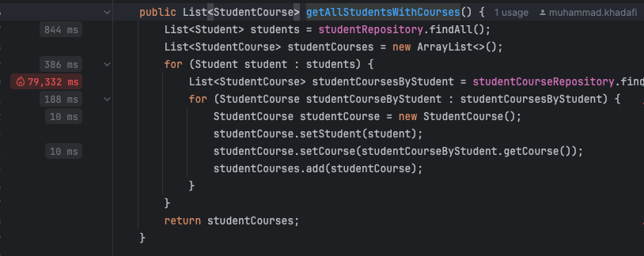
Highest GPA
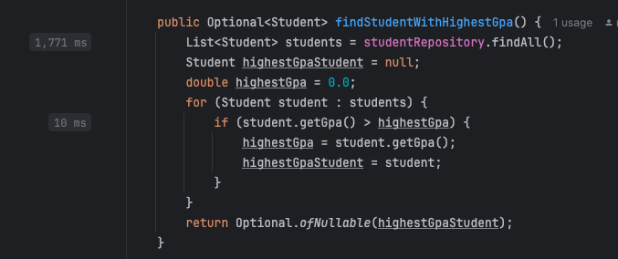
All student name
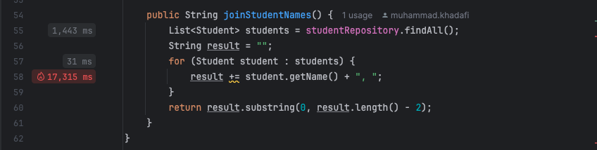
### 2. After (profiling)
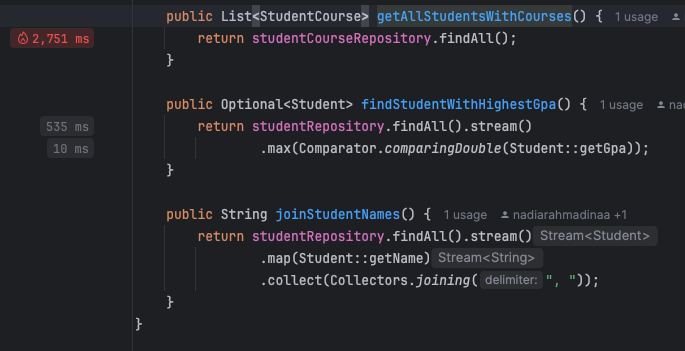
### 3. Before (performance testing)
All student
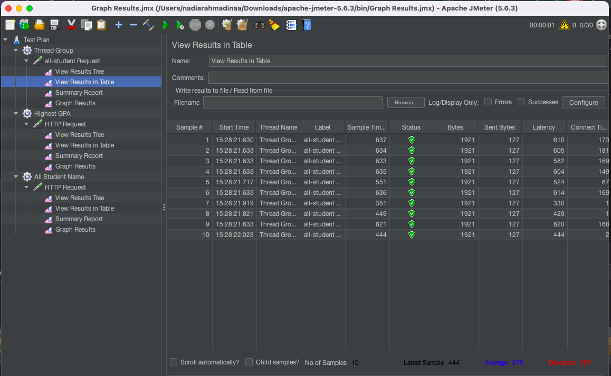
Highest GPA
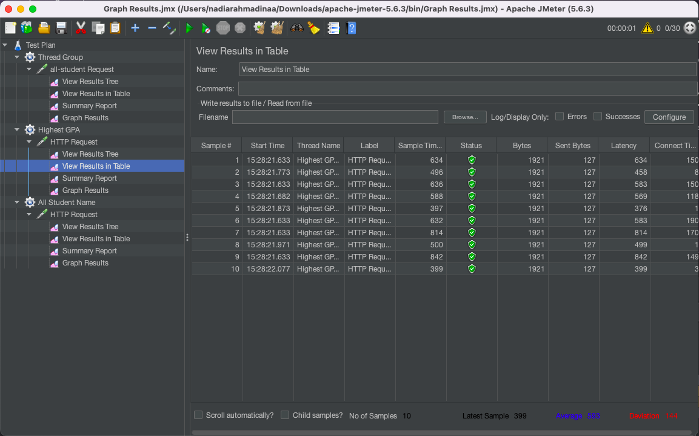
All student name
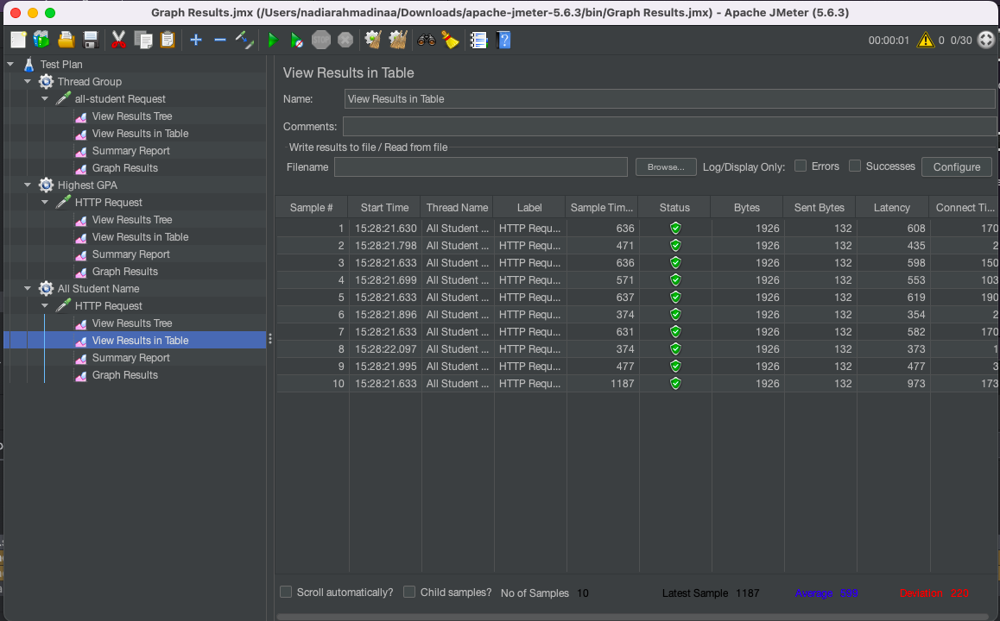
### 4. After (performance testing)
All student
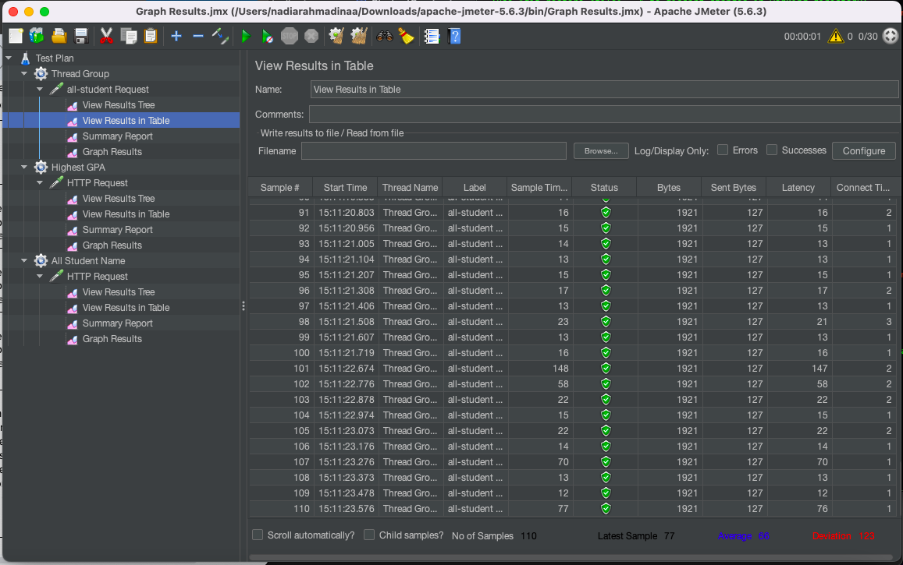
Highest GPA
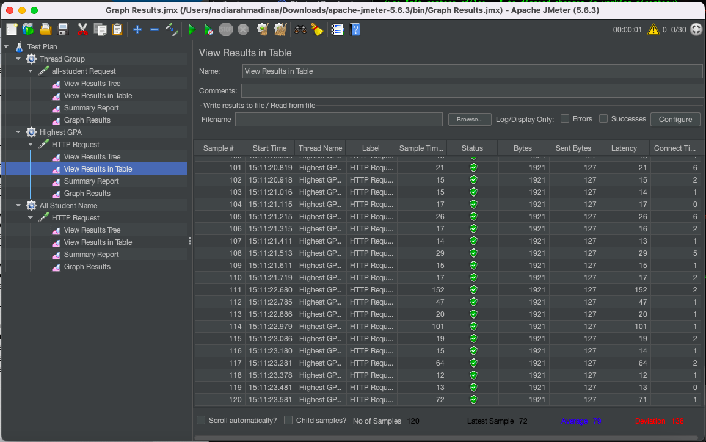
All student name
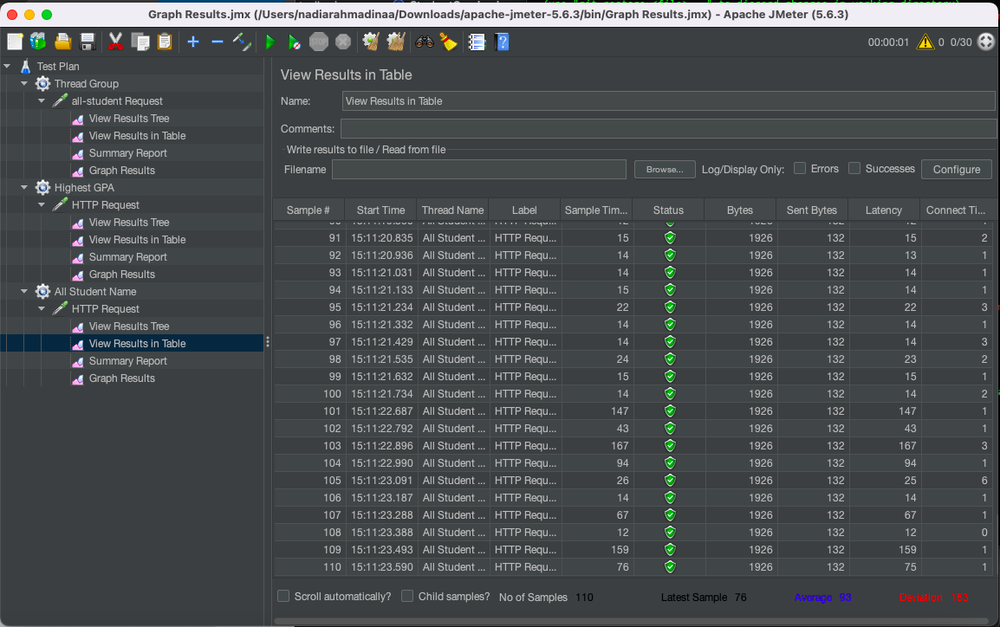
### 5. Performance testing in CLI
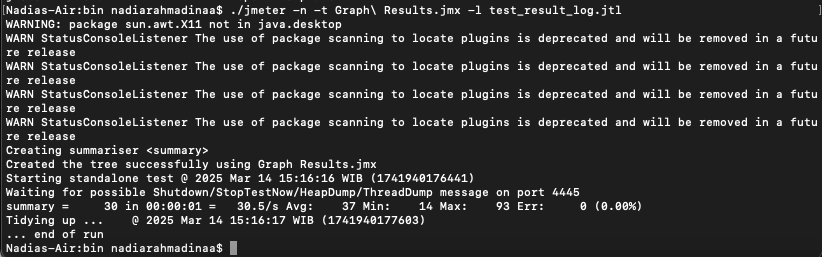
## Kesimpulan
Profiling telah memberikan insight positif dalam melakukan optimisasi kode. Optimisasi setelah profiling dan performance testing menghasilkan optimisasi >20% untuk setiap kategorinya.
Menurut hasil profiling, endpoint /all-student memiliki latensi 79,000 ms. Setelah optimisasi, menurun menjadi 500 ms.
Endpoint /highest-gpa memiliki latensi 1,700 ms. Setelah optimisasi, menurun menjadi 2,700 ms.
endpoint /all-student memiliki latensi 17,000 ms. Setelah optimisasi, menurun menjadi hampir tidak terdeteksi.
